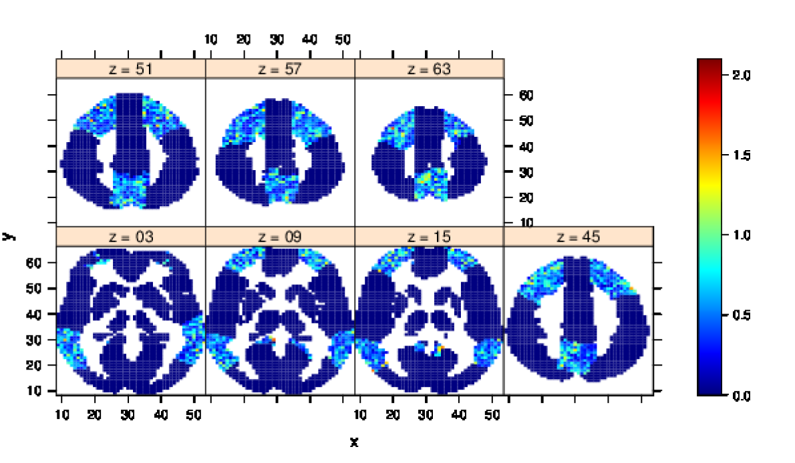
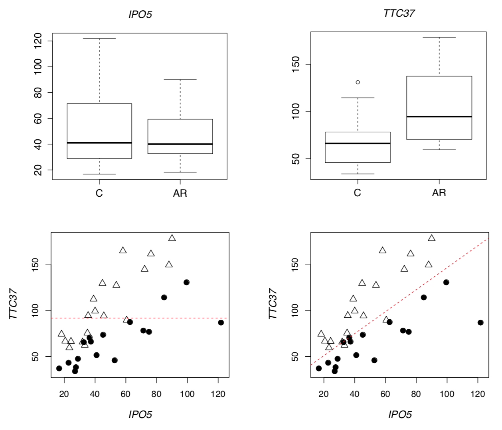

## Statistical Feature Learning methods software for the Boston Lung Cancer Survival Cohort (BLCSC) 

The Boston Lung Cancer Survival Cohort (BLCSC) study is a cancer epidemiology cohort of 11,164 lung cancer cases, enrolled at the Massachusetts General Hospital (MGH), the Dana-Farber Cancer Institute (DFCI), and the Brigham and Women's Hospital since 1992. Dr. David C. Christiani (Harvard TH Chan School of Public Health) is the project director of the BLCSC study, which has collected detailed demographic, smoking, occupational, dietary information, in addition to pathology, radiomics, treatments history, oncogenic mutation status, serum, white blood cells, DNA, and tumor tissues. 

Our mission is to inform the cancer community of predictive or prognostic markers that are critical to the precision medicine.

#### Contributors for this project:

University of Michigan: Yi Li, Jian Kang, Yanming Li, Kevin He, Zhe Fei

Michigan State University: Hyokyoung G. Hong

Harvard University: David C. Christiani and his lab

#### Covariance-insured screening
 * By incorporating the inter-feature dependence, a covariance-insured screening approach is proposed to identify predictors that are jointly informative but marginally weakly associated with outcomes.
 * [paper](https://www.stt.msu.edu/users/hhong/2018-CIS_CSDA_final%20%281%29.pdf) &nbsp; &nbsp;&nbsp; &nbsp;  [R code]
  
#### Partition-based screening
 * Leveraging prior grouping information on covariates, the partition-based screening methods for ultrahigh-dimensional variables is proposed in the framework of generalized linear models.
 
      
Figure. Combined partition-based screening statistics are shown on seven axial slices that cut through eight important brain regions, which have more than 60 selected voxels.
  * [paper](https://www.stt.msu.edu/users/hhong/pbs.pdf)  &nbsp; &nbsp;&nbsp; &nbsp;  [R code]
  

#### Weak signals in high-dimensional regression: Detection, estimation and prediction
 * This method aims to incorporate weak signals in variable selection,
estimation, and prediction.
 

Figure. The role of weak but jointly important variables in distinguishing normal kidney (C, circle) and acute rejection (AR, triangle) in kidney transplant study.
* [paper](https://www.stt.msu.edu/users/hhong/asmb.2340%20%281%29.pdf) &nbsp; &nbsp;&nbsp; &nbsp;   [R code]

#### The Lq-norm learning for ultrahigh-dimensional survival data: an integrated framework
* The Lq-norm learning is proposed to detect predictors with various levels of impact, such as short- or long-term impact, on censored
outcome.
 * [paper](https://www.stt.msu.edu/users/hhong/2018-CMC-0715-4p.pdf) &nbsp; &nbsp;&nbsp; &nbsp;   [R code](https://github.com/younghhk/software/blob/master/R/Lq.R)
  
#### Integrated powered density (IPOD): screening ultrahigh dimensional covariates with survival outcome
 *  With a flexible weighting scheme, Kolmogorov statistic as a special case,  IPOD method can detect early or late impact on censored outcome.
   * [paper](https://www.stt.msu.edu/users/hhong/Hong_et_al-2017-Biometrics.pdf)  &nbsp; &nbsp;&nbsp; &nbsp;  [R code](https://github.com/younghhk/software/blob/master/R/IPOD.R)
 
#### Conditional screening for survival data
 * The recently developed variable screening methods, though powerful in many practical setting,  are less powerful in detecting marginally weak while jointly important signals. A new conditional screening method for survival outcome data computes the marginal contribution of each biomarker given priorly known biological information.
  * [paper](https://www.stt.msu.edu/users/hhong/conditional_survival.pdf)  &nbsp; &nbsp;&nbsp; &nbsp; [R code](https://github.com/younghhk/software/blob/master/R/CS.R)
